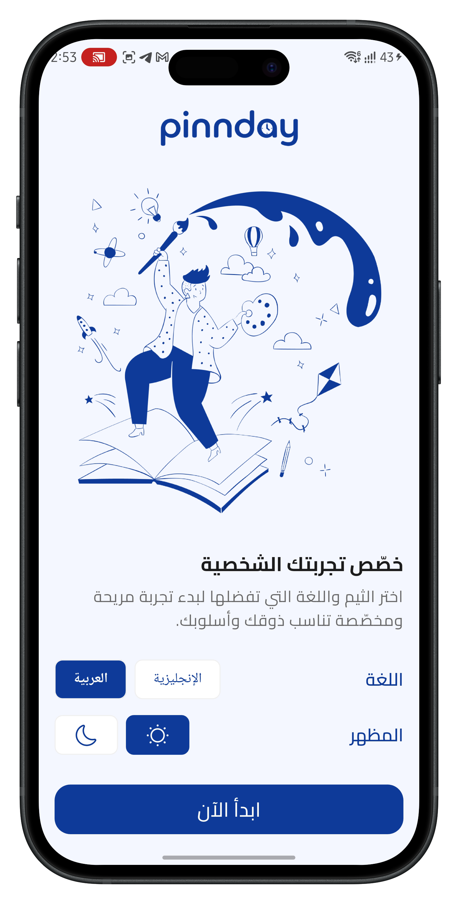
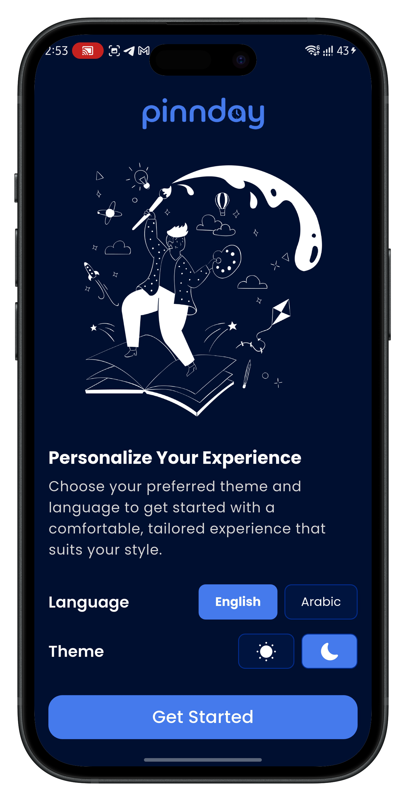
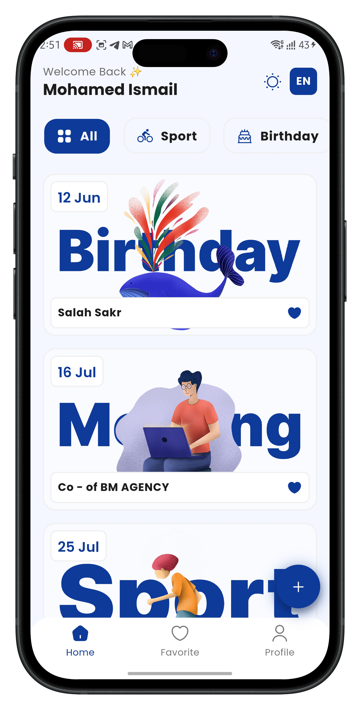
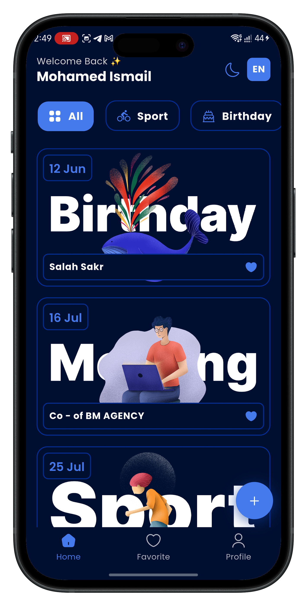
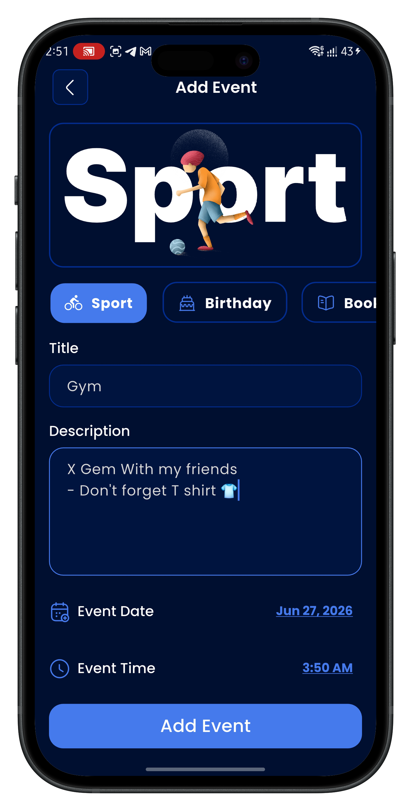
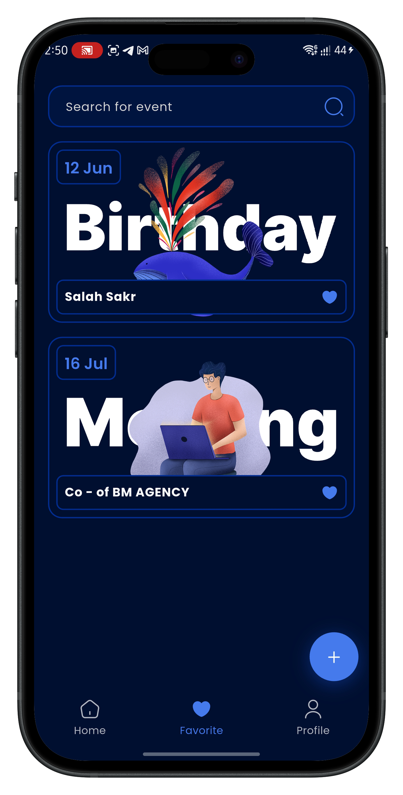
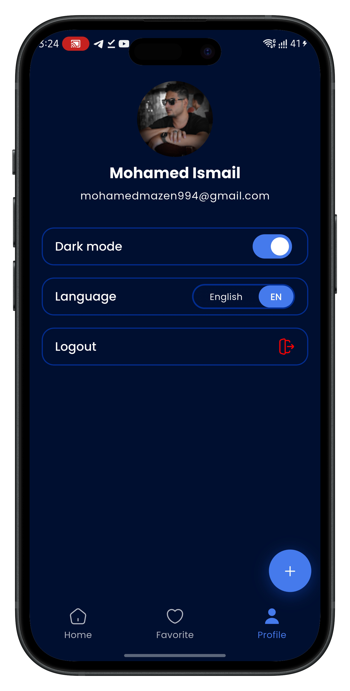

<div align="center">


# 📌 Pinnday

**A smart event planner — Firebase sync, bilingual & dark/light mode.**

[](https://flutter.dev)
[](https://firebase.google.com)
[](https://dart.dev)
[](LICENSE)
[]()

</div>

---

## 🎯 Hero

<p align="center">
  
</p>

---

## 📸 Screenshots

<div align="center">

### Onboarding
| Light | Dark |
|:-----:|:----:|
|  |  |

### Home
| Light | Dark |
|:-----:|:----:|
|  |  |

### Core Screens
| Add Event | Favourites | Profile |
|:---------:|:----------:|:-------:|
|  |  |  |

</div>

---

## ✨ Features

- 🔐 **Firebase Auth** — Google Sign-In & Email/Password login
- 📅 **Event Management** — Add, edit, and delete events with real-time Firestore sync
- ❤️ **Favourites** — Pin any event with a single tap, unpin from the favourites screen
- 🔍 **Search** — Filter favourite events by title instantly
- 🗂️ **Categories** — Sport, Birthday, Meeting, Book Club, Exhibition
- 🌙 **Dark / Light Theme** — Toggle from home screen or profile
- 🌐 **Bilingual** — Full Arabic & English support with RTL layout
- 🚀 **Onboarding** — Language & theme setup on first launch
- 👤 **Profile Screen** — View name, email, change theme/language, and sign out

---

## 🛠 Tech Stack

| Layer | Technology |
|-------|-----------|
| Framework | Flutter 3.x |
| Backend | Firebase Auth + Cloud Firestore |
| State Management | Provider |
| Localization | flutter_localizations + intl |
| Icons | iconsax |
| SVG | flutter_svg |

---

## 🚀 Getting Started

### Prerequisites

- Flutter SDK `>=3.0.0`
- Firebase project with **Auth** & **Firestore** enabled

### Installation

```bash
# 1. Clone the repo
git clone https://github.com/YOUR_USERNAME/pinnday.git
cd pinnday

# 2. Install dependencies
flutter pub get

# 3. Add your Firebase config files
#    → android/app/google-services.json
#    → lib/firebase_options.dart

# 4. Run the app
flutter run
```

> ⚠️ **Important:** Never commit `google-services.json` or `firebase_options.dart` — they contain your private API keys.

---

## 📁 Project Structure

```
lib/
├── core/
│   ├── theme/               # ThemeProvider, AppColors
│   └── lang/                # LangProvider, L10N
├── generated/               # Auto-generated localization files
├── ui/
│   ├── onboarding/          # Onboarding screens
│   ├── auth/                # Login screen
│   └── home/
│       ├── homeScreen/      # Home + EventsCards widget
│       ├── favouriteScreen/ # Favourites + FavoriteCards widget
│       ├── profileScreen/   # Profile screen
│       └── events_manegment/
│           ├── add_events/
│           ├── edit_events/
│           ├── events_details/
│           └── events_model/  # Events model
└── main.dart
```

---

## 🔥 Firestore Data Structure

```
events (collection)
└── {eventId} (document)
    ├── userId        : String   ← owner's UID
    ├── title         : String
    ├── description   : String
    ├── type          : String   ← Sport | Birthday | Meeting | Book Club | Exhibition
    ├── date          : String
    ├── time          : String
    ├── bgImage       : String   ← asset path
    ├── eventImage    : String   ← asset path
    └── isFavorite    : Boolean
```

---

## 🤝 Contributing

Pull requests are welcome. For major changes, please open an issue first.

1. Fork the project
2. Create your feature branch (`git checkout -b feat/amazing-feature`)
3. Commit your changes (`git commit -m 'feat: add amazing feature'`)
4. Push to the branch (`git push origin feat/amazing-feature`)
5. Open a Pull Request

---

## 📄 License

MIT © 2026 — Mohamed Ismail

---

<div align="center">
Made with ❤️ using Flutter
</div>
